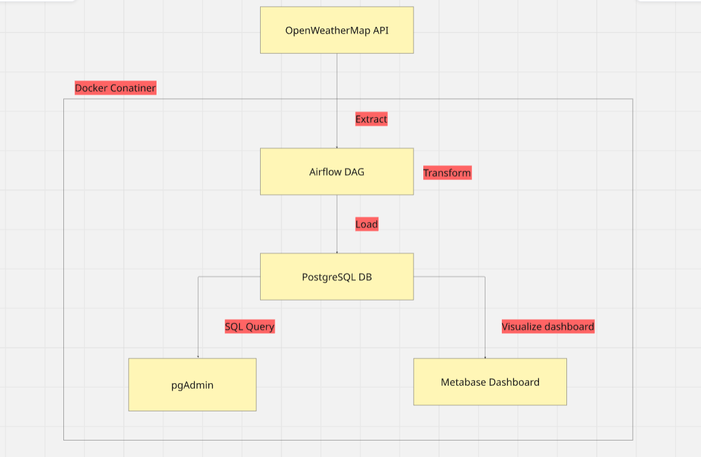
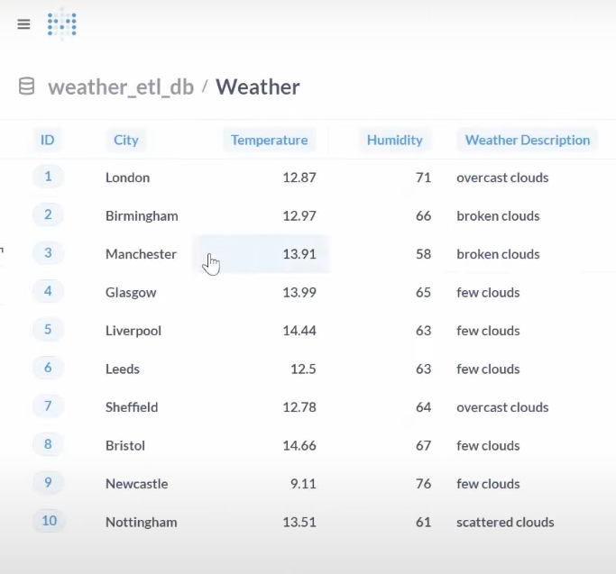
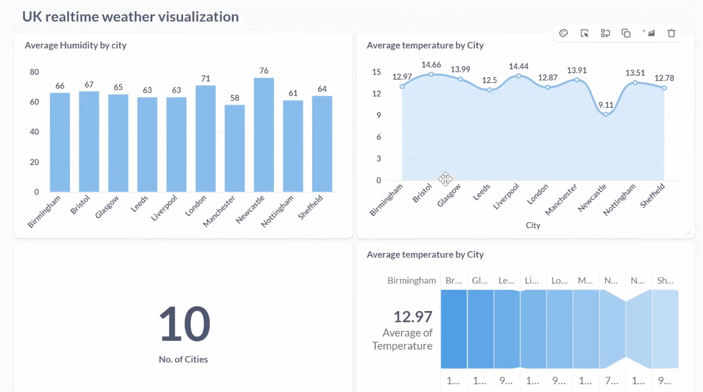

# 🌦️ Weather Data Pipeline with Airflow, Postgres, Metabase and Docker 

This is an end-to-end data pipeline that fetches daily weather data for UK cities using the OpenWeatherMap API, stores it in a PostgreSQL database via Apache Airflow, and visualizes it using Metabase.

## 🛠️ Tech Stack

- **Airflow** (ETL Orchestration)
- **PostgreSQL** (Data Warehouse)
- **Docker Compose** (Containerized Infra)
- **Metabase** (Visualization)
- **pgAdmin** (DB GUI)

## 🧱 Architecture Overview

The project follows a modern data pipeline architecture:

1. **Data Collection**: OpenWeatherMap API provides real-time weather data
2. **ETL Process**: Apache Airflow orchestrates the data pipeline
3. **Data Storage**: PostgreSQL database stores the processed data
4. **Data Visualization**: Metabase creates interactive dashboards
5. **Database Management**: pgAdmin provides database administration interface



## 🚀 Features

- Fetches real-time weather data for major UK cities using lat/lon
- Inserts weather data into a normalized Postgres schema
- Automates and schedules via Airflow
- Easy setup using Docker Compose
- Clean dashboard via Metabase

## 📊 Data Visualization

The project includes comprehensive data visualization through Metabase:

### Database Schema


### Interactive Dashboard


## 🛠️ Setup and Installation

1. Clone the repository
2. Configure environment variables
3. Run `docker-compose up -d`
4. Access the services:
   - Airflow: http://localhost:8080
   - Metabase: http://localhost:3000
   - pgAdmin: http://localhost:5050

## 📝 Environment Variables

Create a `.env` file with the following variables:
```
OPENWEATHERMAP_API_KEY=your_api_key
POSTGRES_USER=your_username
POSTGRES_PASSWORD=your_password
POSTGRES_DB=weather_db
```

## 🔄 Data Pipeline Flow

1. Airflow DAG triggers daily data collection
2. Weather data is fetched from OpenWeatherMap API
3. Data is transformed and normalized
4. Processed data is stored in PostgreSQL
5. Metabase visualizes the data in real-time

## 📈 Data Schema

The database schema is optimized for weather data analysis with tables for:
- Cities
- Weather measurements
- Historical data
- Forecast data

## 🤝 Contributing

Contributions are welcome! Please feel free to submit a Pull Request.

## 📄 License

This project is licensed under the MIT License - see the LICENSE file for details.

## 👥 Authors

- Surya Prakasha P K

## 🙏 Acknowledgments

- OpenWeatherMap API for weather data
- Apache Airflow community
- Metabase team
- PostgreSQL community

---
